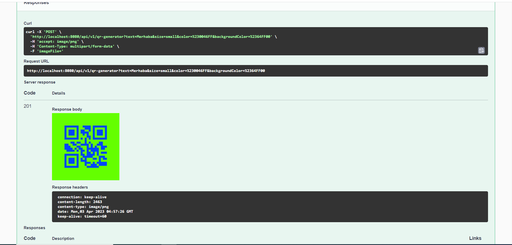

# Spring Boot QR Generator Example


### 📖 Information

<ul style="list-style-type:disc">
  <li>The application receives the requested information to generate <b>QR code</b> containing text message, color, background color and size with file upload option or not through through `/api/v1/qr-generator`</li> 
  <li>The <b>QR code</b> is generated through validations defined below 
       <ul>
            <li><b>color validation</b> to check whether color is defined as hex color code</li>
            <li><b>text length validation</b> to check whether text is ranged between two defined length size (1-50)</li>
            <li><b>Size validation</b> to check whether if the size should be defined as <b>small</b>, <b>medium</b> and lastly <b>large</b></li>
       </ul>
  </li>
</ul>

### Explore Rest APIs

<table style="width:100%">
  <tr>
      <th>Method</th>
      <th>Url</th>
      <th>Description</th>
      <th>Valid Request Params</th>
  </tr>
  <tr>
      <td>POST</td>
      <td>/api/v1/qr-generator</td>
      <td>Qr Code Generator with Image</td>
      <td><a href="README.md#qrcodegeneratorwithimage">Info</a></td>
  </tr>
  <tr>
      <td>POST</td>
      <td>/api/v1/qr-generator</td>
      <td>Qr Code Generator without Image</td>
      <td><a href="README.md#qrcodegeneratorwithoutimage">Info</a></td>
  </tr>
</table>

### Valid Request Body

##### <a id="qrcodegeneratorwithimage"> Qr Code Generator with Image
```
    http://localhost:8080/api/v1/qr-generator
    
    form-data
    text : Merhaba
    size : small
    color : #0046FF
    backgroundColor : #64FF00
    imageFile : File Upload
```


##### <a id="qrcodegeneratorwithoutimage"> Qr Code Generator without Image
```
    http://localhost:8080/api/v1/qr-generator
    
    form-data
    text : Merhaba
    size : small
    color : #0046FF
    backgroundColor : #64FF00
```


### Technologies

---
- Java 17
- Spring Boot 3.0
- Open API Documentation
- Restful API
- Spring Boot Validation
- Google Zxing Core
- Google Zxing Java Standart Edition (SE)
- Lombok
- Maven
- Junit5
- Mockito
- Integration Tests
- Docker
- Docker Compose

### Prerequisites

---
- Maven or Docker
---

### Docker Run
The application can be built and run by the `Docker` engine. The `Dockerfile` has multistage build, so you do not need to build and run separately.

Please follow directions shown below in order to build and run the application with Docker Compose file;

```sh
$ cd qr-generator-example
$ docker-compose up -d
```

---
### Maven Run
To build and run the application with `Maven`, please follow the directions shown below;

```sh
$ cd qr-generator-example
$ mvn clean install
$ mvn spring-boot:run
```

### Swagger
You can reach the swagger-ui through the link shown below
```
    http://localhost:8080/swagger-ui/index.html
```

### Screenshots

<details>
<summary>Click here to show the screenshots of project</summary>
    <p> Figure 1 </p>
    
    <p> Figure 2 </p>
    
    <p> Figure 3 </p>
    
    <p> Figure 4 </p>
    
    <p> Figure 5 </p>
    
    <p> Figure 6 </p>
    
    <p> Figure 7 </p>
    
</details>